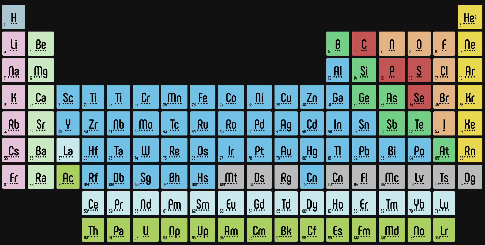

# periodic-table

## About

This was a challenge set by the coaches at _nology. It was designed to include the use of HTML, CSS, and other areas of learning up to this point.

The challenge was to recreate this periodic table:

I opted to use a grid which seemed like the most intuitive approach. We were instructed to use the BEM convention in combination with SASS to make styling and readability as easy to read as possible.

In future iterations I plan to add some responsiveness to the design to allow the table to fit on to as many different screen sizes as possible, as currently it only fits comfortably on large displays.
